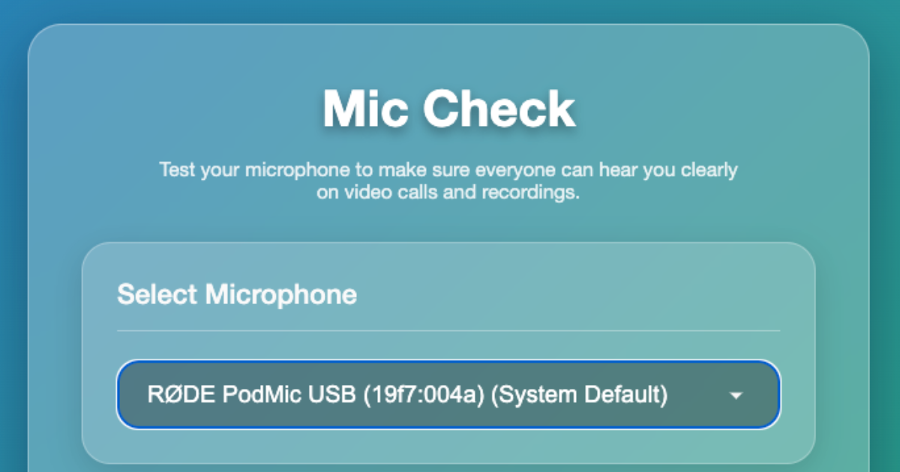

# Mic Check

## [Try it live: mic-check.mbdr.ai](https://mic-check.mbdr.ai)

## About

Mic Check is a simple web application that helps you test your microphone quality for video calls, online meetings, and recordings. It allows you to:

- Select from multiple microphone inputs
- Record your voice with a simple interface
- Visualize audio in real-time while recording
- See a detailed spectrogram of your recording
- Play back your recording to hear exactly how you sound to others

## Why Mic Check?

It's surprisingly difficult to know how you sound to others during video calls. Most systems don't provide an easy way to record and play back your microphone input. Mic Check solves this problem with a simple, browser-based tool.

## Privacy

Mic Check respects your privacy:
- All audio processing happens locally in your browser
- No microphone recordings are ever uploaded to any server
- The application works completely client-side
- Only anonymous analytics are collected (with consent)

## Technology

This application was developed using:
- HTML5 Web Audio API
- JavaScript for audio processing and visualizations
- CSS for the modern glassmorphic UI
- Built with assistance from Gemini 2.5 Pro I/O edition

## How to Use

1. Visit [mic-check.mbdr.ai](https://mic-check.mbdr.ai)
2. Select your preferred microphone from the dropdown
3. Click "Record" and speak normally
4. Click "Stop" when finished
5. Listen to the playback and view the audio spectrogram
6. Repeat as needed to test different microphones or settings

## Development

To run this project locally, simply clone the repository and open `index.html` in your browser. No build steps or server setup required.

## License

© 2025 [Megan Ruthven](https://mbdr.ai) 